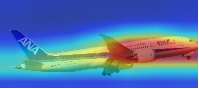
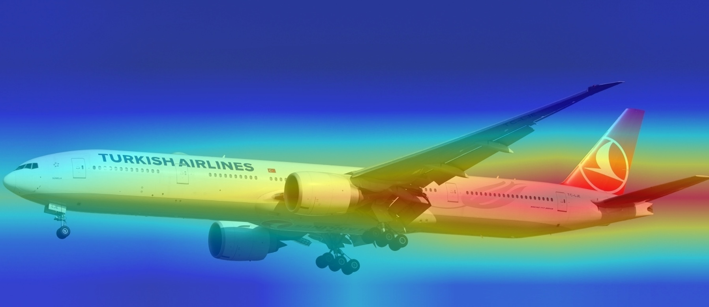
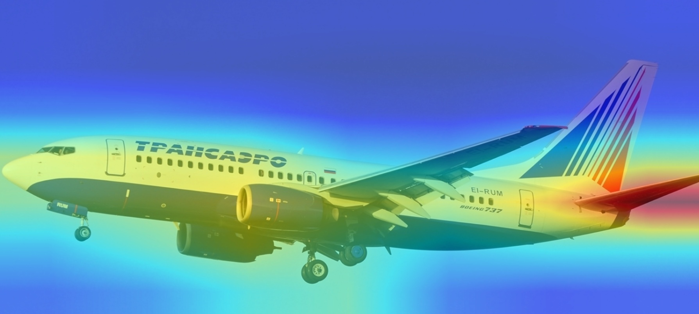
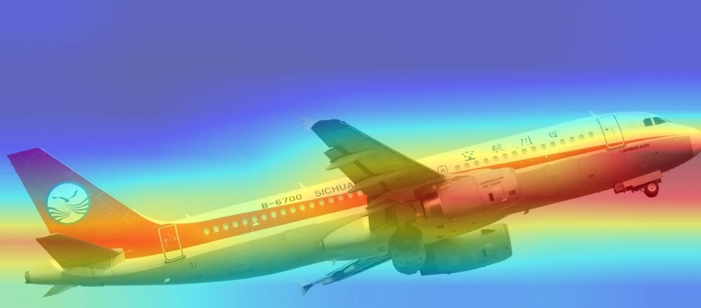
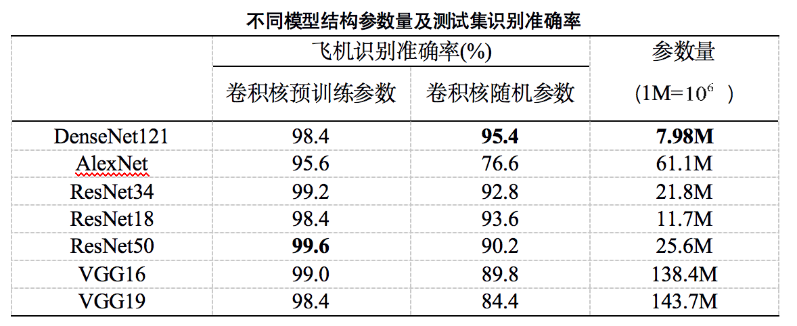

# Aircraft Recognition Based on Convolutional Neural Network
## Introduction
   Image recognition is a technology using computer to analyze and process images to identify targets and objects in various modes. Image segmentation is the basis and one of the key technologies of image recognition. it is the extraction of meaningful features in images, such as edges, areas, etc.  Image segmentation usually divides images into specific region with, unique characteristics, and further analyzes and processes the region of interest. Such methods are vulnerable to external factors such as light and noise. Although many methods of edge extraction and region segmentation have been studied, there is still no effective method that is generally applicable to various images. In recent years, as a typical representative of deep learning, Convolutional Neural Networks (CNN) has attracted wide attention in the field of image processing. By using neural network to complete the feature extraction task, and then the feature vector is input into the traditional machine learning classification model such as multi-layer perceptron and logistic regression, which can greatly improve the image recognition rate. This is an effective and universal image recognition method, which is not affected by light, noise, etc.
   
   CNN is a kind of feed-forward neural network with convolution computation and deep structure. It has the advantages of simple structure, high recognition accuracy and strong fitting ability. Based on CNN deep learning algorithm, this paper studies the related issues of aircraft model identification. A CNN model is established to learn a large number of aircraft image data, so as to achieve the accurate identification and classification of aircraft images. Meanwhile, the neural network visualization is used to provide reliable interpretation for the obtained identification results 5,000 images of five well-known civil airliners are collected to form a data set of aircraft types. The data set of aircraft types is divided into a training and a test set according to an 8:2 ratio. In terms of neural network construction, this paper uses PyTorch, the most popular framework for deep learning to build 7 different types of CNN, including Alexnet, VGG, etc. to learn five types of aircraft images. Some good identification results are obtained, and the identification performance of different kinds of CNN is compared. A confusion matrix is used to analyze the identification results. Under the condition of using ImageNet pre-training parameters, the accuracy rate of different types of CNN identification aircraft models is more than 90%. When using random initialization parameters, except for AlexNet, other types of CNN identification accuracy rate reaches more than 80%, which providing a reference for CNN to be applied aircraft type identification.

## analysis

The key positions of the fuselage and wing of each type of machine are highlighted in red. The color from blue to red represents the degree of attention of CNN. The more red, the higher the degree of attention, and also the CNN identification standard. It is not difficult to find that the red area is the most different of the five aircraft models. According to the order from left to right and top to bottom, the five heat maps are visualized on ResNet18 for five models of boeing787-8, boeing777-300, boeing747-400, boeing737-700 and airbus320. Type, CNN focuses on the aircraft fuselage, including body color, wing color, aircraft trademarks and other major airline trademarks, and for large-area sky, ground buildings and other interference information, CNN can filter, so Accurate classification of five types of models.
## Model performance

